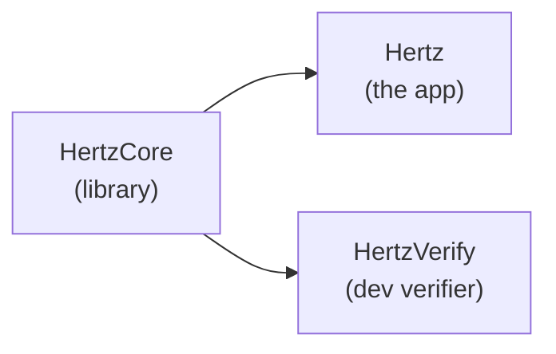
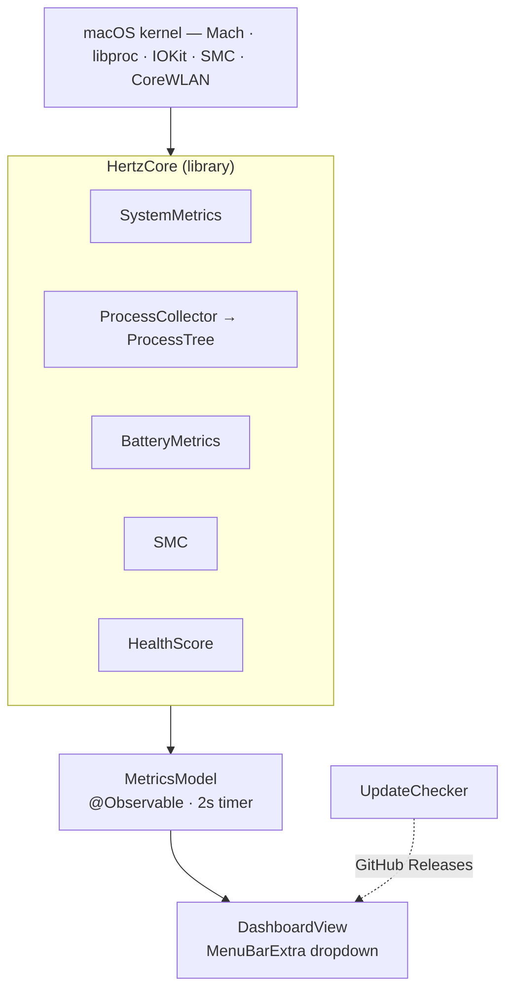
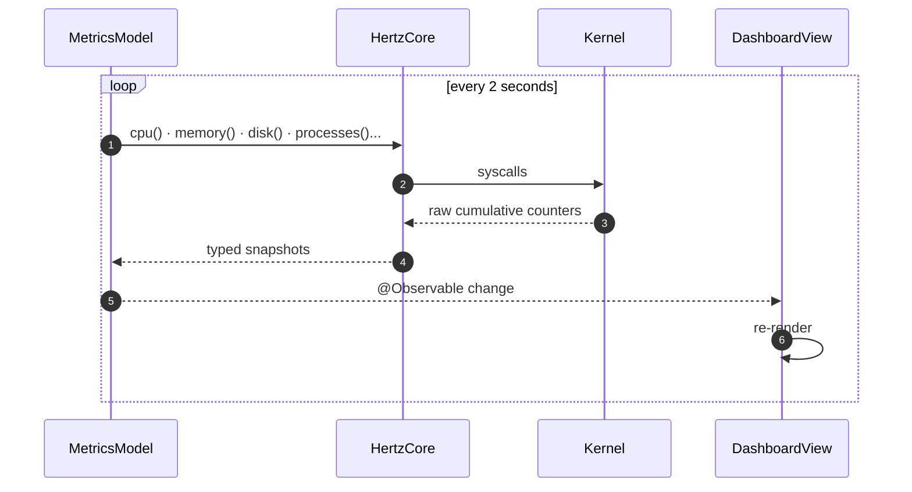
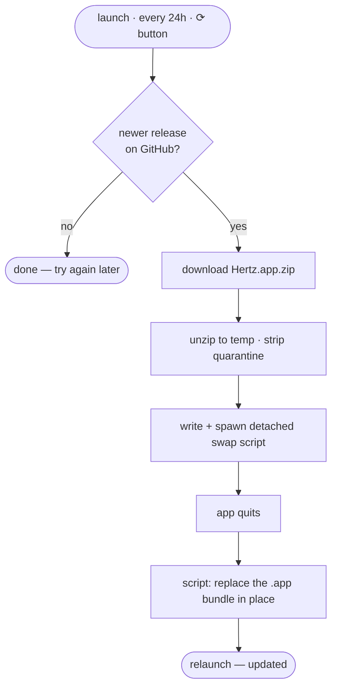
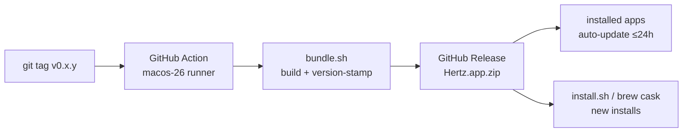

# Architecture

How Hertz is put together — for anyone working on it.

## Shape

A SwiftUI menu-bar app with no third-party dependencies. Everything is read
from the OS directly (Mach, libproc, IOKit, SMC, CoreWLAN). Swift 6.2, built
with SwiftPM.

## Targets

```
Sources/HertzCore/     library — metric collectors, pure data, no UI
Sources/Hertz/         executable — the SwiftUI menu-bar app
Sources/HertzVerify/   executable — dev-only metric verifier
```



- **HertzCore is a library** so the app *and* the verifier exercise the exact
  same collector code — what you verify is what ships.
- **HertzVerify is an executable, not a test target**, because the Command
  Line Tools toolchain ships no XCTest. It never lands in the app bundle.
- All targets are `MainActor`-isolated by default (`defaultIsolation`,
  Swift 6.2). Collectors are plain synchronous code.

## Data flow



`MetricsModel` runs a 2-second timer on the main actor, calls every collector,
and stores the snapshots. The SwiftUI views observe the model and re-render.
`UpdateChecker` runs independently on its own schedule.

### The refresh cycle



## The collectors (`HertzCore`)

| File | Provides | OS interface |
| --- | --- | --- |
| `SystemMetrics.swift` | CPU, thermal pressure, memory pressure, disk, network, hardware info | Mach `host_*`, Darwin notify, `sysctl`, `statfs`, IOKit, `getifaddrs`, CoreWLAN |
| `ProcessCollector.swift` | process list — pid, name, CPU, memory, path | `libproc` |
| `ProcessTree.swift` | parent/child forest + subtree CPU/memory sums | (pure transform of the process list) |
| `BatteryMetrics.swift` | charge, health, cycles, temperature, battery/adapter wattage | IOKit power sources + `AppleSmartBattery` registry |
| `SMC.swift` | CPU temperature, fan speed | the `AppleSMC` user client |
| `HealthScore.swift` | composite 0–100 score | (pure function of the snapshots) |

## Metric accuracy — the non-obvious bits

These were all found and fixed against `top` / Activity Monitor / `ioreg`:

- **Rates need two samples.** The kernel exposes *cumulative counters* (CPU
  ticks, bytes transferred). Any `%` or `/s` value is a delta between two
  reads over the elapsed time.
- **Per-process CPU** — `proc_taskinfo`'s `pti_total_*` are Mach
  absolute-time units, **not nanoseconds**. They're converted with
  `mach_timebase_info` (1/1 on Intel, 125/3 on Apple silicon).
- **CPU total** — the arithmetic mean of per-core percentages. Matches `top`;
  a tick-weighted ratio skews on Apple silicon as cores park.
- **Thermal pressure** — Darwin's `com.apple.system.thermalpressurelevel`
  notification keeps the useful moderate/heavy split. If that private-but-stable
  signal is unavailable, Hertz falls back to `ProcessInfo.thermalState`.
- **Process memory** — physical footprint (`proc_pid_rusage`), not RSS.
  Matches Activity Monitor's "Memory" column.
- **Memory pressure** — uses the kernel pressure sysctls when available:
  `vm.memory_pressure` for the 0-100 signal and
  `kern.memorystatus_vm_pressure_level` for the normal/warning/critical band.
- **Disk** — the physical-disk view (whole volume), not `df`'s per-volume
  "used", which hides other APFS volumes and snapshots.

The `HertzVerify` tool cross-checks every metric against an independent system
command and must report `ALL CHECKS PASSED`.

## The app (`Hertz`)

| File | Role |
| --- | --- |
| `HertzApp.swift` | `@main` App — `MenuBarExtra` (`.window` style), starts `UpdateChecker` |
| `MetricsModel.swift` | `@Observable` state + the 2s refresh timer |
| `DashboardView.swift` | the whole dropdown UI — sectioned vertical panel |
| `UpdateChecker.swift` | auto-update from GitHub Releases |

### Dropdown layout

```
┌──────────────────────────────────────────────┐
│  ● 100 Excellent · Apple M4 · 16 GB   up 1d   │  hardware header
├──────────────────────────────────────────────┤
│  ▣ CPU                                 14.9%  │
│     ∿∿∿ sparkline ∿∿∿                          │
│     ▁▃▅▂ per-core bars        load · temp      │
├──────────────────────────────────────────────┤
│  ▤ MEMORY                                66%  │
│     ∿∿∿ sparkline ∿∿∿     Used·Free·Swap        │
├──────────────────────────────────────────────┤
│  ▥ DISK     ◐      ▥ NETWORK    ↓ / ↑          │
├──────────────────────────────────────────────┤
│  ▸ BATTERY                          100%  ⚡︎  │
├──────────────────────────────────────────────┤
│  ∿ TOP PROCESSES               CPU      MEM    │
│     ▸ App (9)                  12.4   1.2 GB   │  process tree,
│        helper                   0.4   350 MB  │  expandable
├──────────────────────────────────────────────┤
│  ∿ Hertz 0.1.0  ⟳            ☑ Login    Quit ⏻ │  footer
└──────────────────────────────────────────────┘
```

One vertical instrument panel divided by hairlines. UI stays flat and native —
no gradients, no faux-glass.

## Auto-update

`UpdateChecker` checks `releases/latest` on the GitHub API at launch, every
24 hours, and on the footer ⟳ button.



A running app can't overwrite its own bundle, so the swap is handed to a
detached shell script that waits for the process to exit first.

## Build & release pipeline



- `scripts/bundle.sh` — compiles release, assembles `Hertz.app`, stamps the
  version from the tag, ad-hoc signs.
- `scripts/makeicon.sh` — renders the app icon to `AppIcon.icns`.
- `install.sh` — downloads the latest release zip into `~/Applications`.
- The Homebrew cask lives in a **separate** repo, `pranshugupta54/homebrew-tap`.

## Distribution model

The app is **ad-hoc signed**, not Apple-notarized (no paid Developer
account). Installs go to `~/Applications` — user-owned, so the in-app
self-updater needs no admin password. The installers (`install.sh` and the
cask `postflight`) strip the download quarantine so there's no Gatekeeper
prompt.
